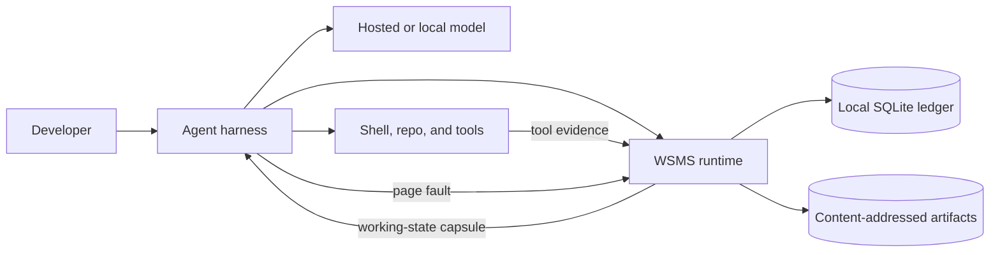
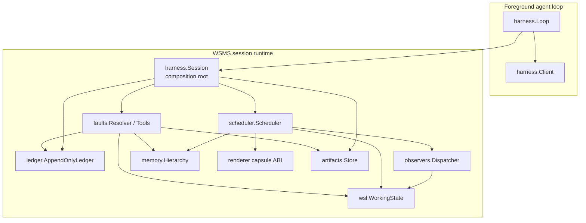
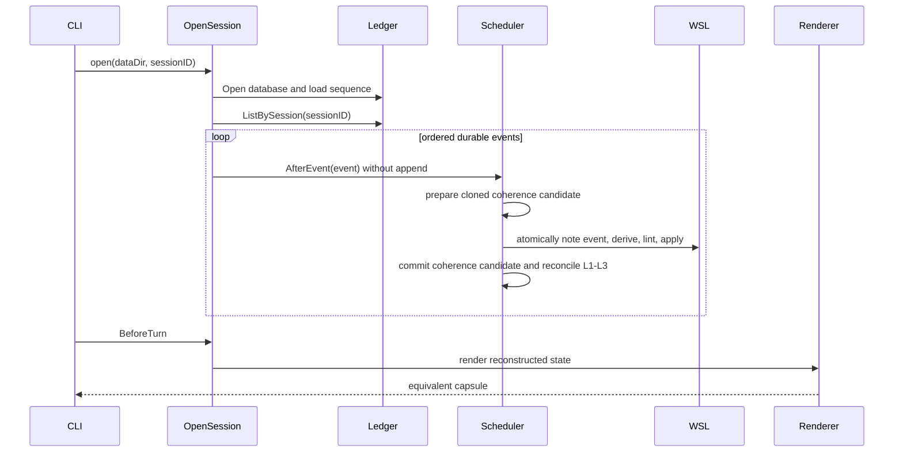
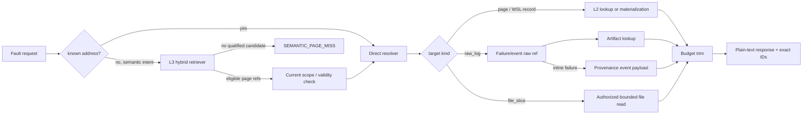
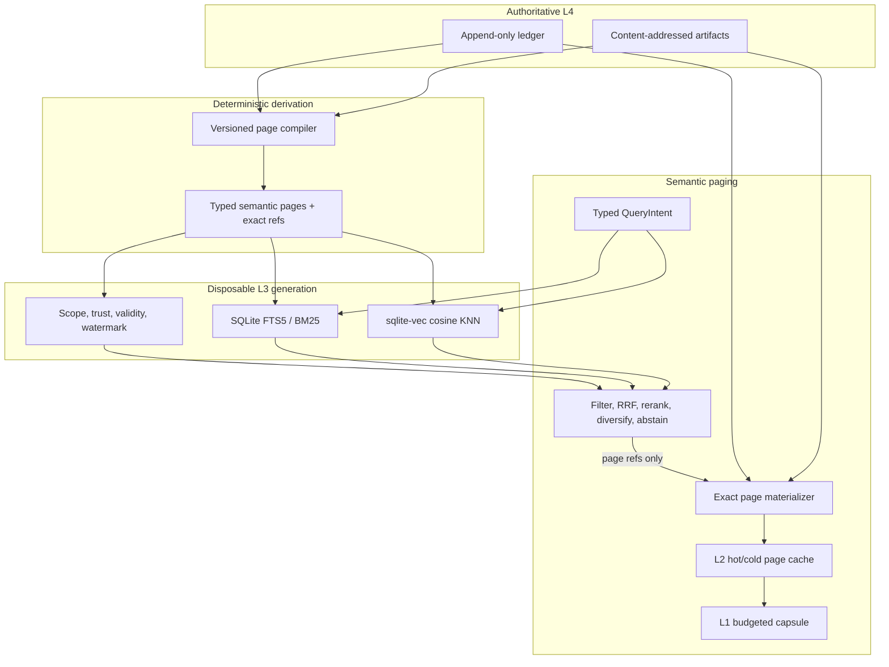
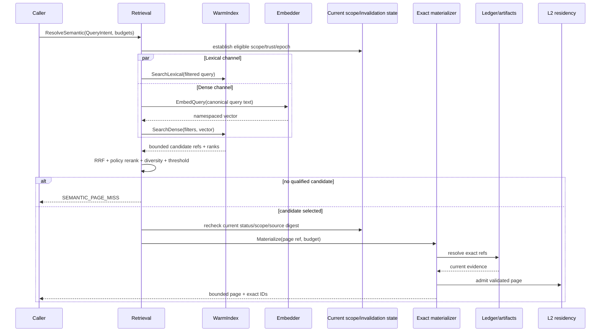
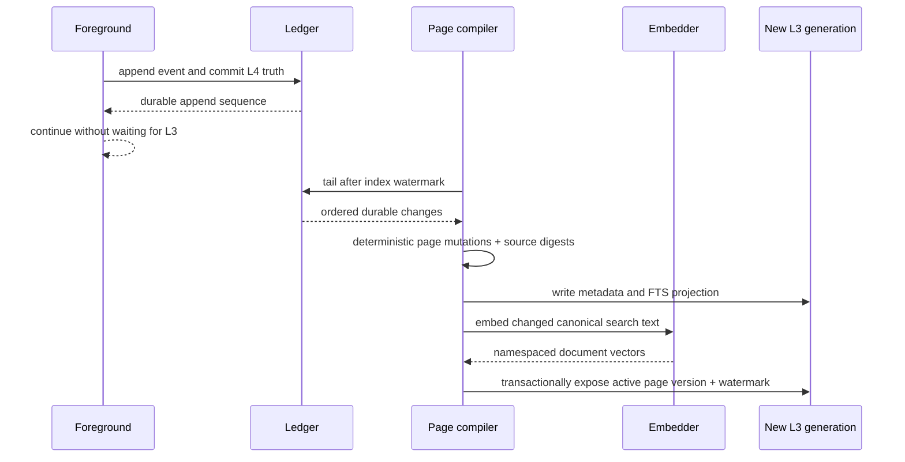
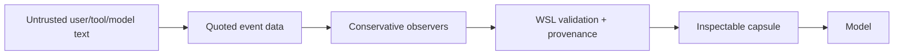

# WSMS Architecture

**Status:** Normative product architecture; the first demo is a bounded vertical slice  
**Version:** 0.1  
**Date:** 2026-07-10

## 1. Architectural goal

WSMS keeps a coding agent's operational working state outside the transcript
while preserving exact evidence. The model context is a bounded resident set;
the append-only ledger and content-addressed artifacts are durable truth.

The architecture optimizes four properties:

1. **Continuity:** active task state survives compaction and process restart.
2. **Fidelity:** exact commands, errors, constraints, paths, and raw logs remain
   recoverable without paraphrase.
3. **Sharpness:** only the most useful state is resident in the next model turn.
4. **Inspectability:** humans can see why a fact is resident and retrieve its
   evidence.

## 1.1 Unix virtual-memory correspondence

Unix memory-management design is the organizing model for WSMS, not merely a
naming metaphor. WSMS borrows the separation between a process's active working
set and its larger durable address space, plus the separation of paging
mechanism from residency policy.

| Unix / VM concept | WSMS analogue | Architectural consequence |
|---|---|---|
| Process virtual address space | Complete session event/evidence space | The agent can address more history than fits in context |
| Resident working set | L1 `<working_state>` capsule | Context contains the currently useful subset, not all history |
| Page / virtual address | Stable WSL record, page, event, or artifact ID | Missing detail is requested by identity rather than guessed |
| Page table / mapping metadata | `WorkingState`, hierarchy metadata, provenance index | IDs resolve to current typed state and backing evidence |
| Physical frame budget | Capsule token budget | Residency is explicitly bounded |
| Pinned / unevictable page | Hard user constraint | Governance-critical state survives ordinary reclamation |
| Backing store / swap | Append-only ledger plus content-addressed artifacts | Exact truth remains outside the resident prompt |
| Page fault | `ReadPage` / `ReadRawLog` request | Non-resident evidence is loaded on demand |
| Page-in | Fault result rendered into the current interaction | Detail becomes temporarily available without bloating every turn |
| Eviction / reclamation | Dropping optional capsule blocks or demoting pages | Low-value state leaves L1 while remaining recoverable |
| Working-set locality | Scope, recency, salience, access, and staleness policy | Scheduler favors state needed by the current task/branch |
| Write-through cache | Event append before derived-state update | Durable truth precedes and can rebuild caches |

### Mechanism versus policy

- **Mechanism:** ledger/artifact persistence, typed IDs, page lookup, bounded
  rendering, and fault delivery.
- **Policy:** which records are pinned, promoted, demoted, invalidated, or
  evicted under the active token budget.

L3 semantic search is a policy aid, not address translation. It estimates which
stable page addresses may belong to the next working set. The direct resolver
and L4 provenance path remain the paging mechanism.

The MVP proves the mechanism with a deliberately simple fixed residency policy.
Later work may improve working-set estimation without changing durable identity
or the page-fault ABI.

### Limits of the analogy

WSMS pages are semantic and variable-sized; model attention is not physical RAM;
and a page fault is an explicit harness operation rather than a CPU trap. The
architecture borrows locality, identity, backing-store, pinning, invalidation,
and demand-paging principles without pretending the model is a literal process.

## 2. Scope and honesty boundary

The MVP is a local Go runtime. It implements deterministic event ingestion,
SQLite persistence, content-addressed artifacts, typed WSL state, safe lifecycle
boundaries, a structured-text renderer, and page-fault tools.

The first executable demo is a **mechanism proof**, not a benchmark result. It
may prove that state survives restart and that exact evidence is retrievable. It
must not claim that WSMS beats summaries, YAML, retrieval, or provider-native
compaction until matched forced-reset evaluation exists.

The MVP processes observers synchronously during `AfterEvent`. “Asynchronous
memory scheduler” describes the target separation of foreground and maintenance
work, not a current goroutine/queue implementation. Safe boundaries and replay
semantics are established first so later workers can be introduced without
changing the provider ABI.

## 3. System context



WSMS does not own the model or tool sandbox. It receives events from the harness
and returns provider-compatible text/tools. Harness policy remains responsible
for authorizing file, shell, network, and external-system access.

## 4. Container and component view



## 5. Package ownership

| Package | Owns | Does not own |
|---|---|---|
| `cmd/wsms` | Argument parsing, operator output, exit status | Runtime truth or business logic |
| `internal/config` | Local paths and budgets | Global mutable configuration |
| `internal/ledger` | Immutable event persistence and ordering | Derived WSL state |
| `internal/artifacts` | SHA-256 addressed immutable bytes | Semantic interpretation |
| `internal/observers` | Event-to-WSL deterministic derivation | Durable truth or arbitrary model inference |
| `internal/wsl` | Grammar, records, canonical serialization, lint, working-state store | Provider formatting |
| `internal/memory` | L0-L3 containers and residency metadata | L4 durability |
| `internal/scheduler` | Safe boundaries, residency scoring/policy, atomic update application, L1 selection, page materialization | Tool authorization |
| `internal/renderer` | Stable provider-facing capsule ABI and budgets | Event ingestion |
| `internal/faults` | Bounded page/raw-log/file-slice resolution | Access-control policy |
| `internal/harness` | Session composition, replay, foreground loop | Provider-specific SDK logic |
| `internal/demo` | Deterministic vertical-slice orchestration and assertions | Production runtime behavior |
| `research` | Frozen-data analysis and benchmark statistics | Authoritative ledger/WSL writes |

## 6. Architectural invariants

### A1 - Durable truth is append-only

Events and artifact bytes are immutable. L1-L3 state is a cache and may be
discarded. No capsule, WSL snapshot, or observer output is allowed to become the
only copy of exact evidence.

### A2 - Event identity is session-scoped

The durable event key is `(session_id, id)`. IDs such as `E0001` are readable
and monotonic within a session. Every lookup through an open ledger is scoped to
that ledger's session. A ledger handle rejects attempts to append or list a
different session rather than acting as a database-wide capability.

This resolves the scaffold mismatch where IDs were allocated per session but
`events.id` was globally unique.

### A3 - Replay equals live derivation

`OpenSession` replays existing events through the same ordered observer and
scheduler path as live events, except it performs no append. For a fixed event
stream and observer/WSL version:

```text
Replay(events) semantically equals LiveApply(events)
```

Replay reconstructs WSL state, L2 pages, known event refs, and observer ID
counters before new events may be appended.

### A3.1 - Append order is store-owned

Every event receives a durable session-local `append_seq` at commit. Replay and
listing order by that sequence. Caller-supplied timestamps remain useful event
metadata but cannot reorder history. Sequence recovery uses the durable maximum
append sequence, not row count or a parsed caller ID.

Within one open `Session`, durable append and derived mapping commit share one
serialization boundary. Observer ID allocation is checkpointed and restored if
the mapping batch is rejected, keeping live addresses identical to replay.

### A4 - Exact fields are immutable

Once non-empty, hard-constraint text and failure command/error fields cannot be
changed or erased by an update with the same record ID. A future correction
must create a new record plus an explicit invalidation/override relation.

### A4.1 - One event applies atomically

All WSL updates emitted for one event validate against a candidate state and
commit together. Derived pages are materialized only after the batch commits.
If any update fails, the pre-event derived state and hierarchy remain unchanged;
the durable event remains available for diagnosis and replay repair.

### A5 - Boundary-only injection

Context-visible changes occur only at:

- `AfterEvent`: digest one durable event into derived state.
- `BeforeTurn`: select and render the L1 capsule.
- `PageFault`: resolve explicitly requested evidence.

Background workers may prepare candidates between boundaries later, but cannot
mutate the prompt mid-turn.

### A6 - Scope gates residency

A record/page must match the active session/repo/task/branch/file scope before
ranking. Invalidated or all-stale pages cannot become resident without explicit
revalidation.

`internal/coherence` is the authoritative, per-session sidecar for this gate.
It replays the same durable events as WSL and binds each derived record/page to
its independently composable repo/task/branch/commit gates, paths, refs, status,
and keyed scope epochs. Repo, branch, commit, and path epochs draw from one
monotonic session clock and advance only at the narrowest affected scope;
returning to an older branch/commit therefore does not revive an old cache entry.
Reference eligibility is recursive and cycle-safe, so a page, decision, or avoid
record cannot outlive ineligible grounding evidence.

Transitions use a candidate/commit protocol. The scheduler prepares a cloned
coherence candidate, derives observer updates, atomically notes the event and
applies the WSL batch, and only then installs the candidate. A rejected WSL
batch cannot advance scope epochs, stale revisions, allocator IDs, hierarchy
flags, or the known-event set. Page faults and capsule rendering serialize on
the same scheduler boundary.

`branch_change`, `commit_change`, and `file_renamed` make affected bindings
stale. `memory_revalidated` may restore only a stale target and must compare the
expected stale revision while citing preexisting eligible evidence. A terminal
`memory_invalidated` target cannot be revalidated. Its reason is one of
`superseded`, `user_rejected`, `source_deleted`, `policy_changed`, or
`security_revoked`.

Path invalidation is terminal for its known subtree and blocks later snapshots
or renames that overlap the revoked namespace. A materialized page carries the
maximum relevant monotonic scope generation. If its descriptor is older than an
eligible logical address, the resolver discards the resident body and
rematerializes from current WSL/L4 evidence instead of refreshing metadata in
place.

Logical invalidation suppresses L1-L3 but never deletes WSL/L4. Raw diagnostics
remain readable for ordinary staleness and the first three invalidation reasons.
`policy_changed` and `security_revoked` fail closed for raw access as well.
The resolver applies this authority check before looking in L2 or falling back
to WSL, so a stale cache body cannot bypass coherence.

### A7 - Misses are not guesses

An unresolved fault returns `PAGE_MISS`. Operational errors propagate as
errors. The resolver cannot synthesize plausible evidence.

### A8 - L3 is a disposable, reference-first cache

Lexical/vector search may return only eligible page references plus an
explanation. The runtime revalidates each reference and materializes its current
evidence from L4 before admission to L2/L1. Deleting the entire L3 index cannot
lose durable evidence or break a known-ID fault.

Embedding namespaces include every representation-affecting input. Different
model revisions, dimensions, distance metrics, normalization, query
instructions, page schemas, or redaction versions are never searched together.

## 7. Live event flow

```mermaid
sequenceDiagram
    participant User
    participant Loop as harness.Loop
    participant Session as harness.Session
    participant Ledger
    participant Artifacts
    participant Scheduler
    participant Observers
    participant WSL
    participant Renderer
    participant Model as harness.Client

    User->>Loop: instruction
    Loop->>Session: IngestUser
    Session->>Artifacts: Put large payload if needed
    Session->>Ledger: Append event
    Ledger-->>Session: stored event with ID
    Session->>Scheduler: AfterEvent(stored event)
    Scheduler->>WSL: NoteEvent(event ID)
    Scheduler->>Observers: OnEvent
    Observers-->>Scheduler: ordered typed updates
    Scheduler->>WSL: lint then apply each update
    Loop->>Session: BeforeTurn
    Session->>Scheduler: BeforeTurn
    Scheduler->>Renderer: RenderCapsule(state, budget)
    Renderer-->>Loop: working-state capsule
    Loop->>Model: system capsule + user message
    Model-->>Loop: assistant response
    Loop->>Session: IngestAssistant
```

### Ordering

Within one session, append and update application are serial. `append_seq`, not
timestamp, defines the stream. An event becomes visible to a later turn only
after ledger append and its atomic observer-update batch succeeds. There is no
transaction spanning SQLite append and in-memory derivation. If derivation
fails, the event remains durable and reopen/replay must surface the same failure
rather than skip it.

A later production design should persist observer/version checkpoints and a
dead-letter state so one malformed event cannot permanently prevent inspection.

## 8. Restart and reset flow



A **model context reset** discards the transcript but may leave the process
running. A **runtime-state restart** closes the session resources and discards
in-memory WSL and L0-L3 before a new composition root replays only durable
state. This does not require launching a second OS process; the proof boundary
is that no original runtime object survives. The demo exercises this stronger
state-reconstruction case rather than a capsule-only or transcript-only reset.

## 9. Page-fault flow



`ReadPage(F1)` is valid even though `F1` is a WSL failure ID rather than a `P`
page ID: the resolver materializes record detail into L2. Future APIs should
distinguish record faults, page faults, and event faults in metadata while
retaining this convenient lookup behavior.

The first demo implements only the known-address side. The post-demo semantic
path discovers a possible address, then rejoins this same resolver. It never
defines a vector-only evidence path.

## 10. Durable data design

### 10.1 SQLite ledger

`events` stores the immutable envelope. Its primary key is composite:

```sql
PRIMARY KEY (session_id, id)
UNIQUE (session_id, append_seq)
```

Indexes support `(session_id, append_seq)` ordering. `Get`, list, and append
always bind the open ledger's session ID. A pre-0.1 scaffold database with the
old global primary key has no compatibility promise; the first tagged release
must introduce explicit schema versioning before further incompatible changes.

`wsl_snapshots` is reserved for replay acceleration. A snapshot is never
authoritative without an event watermark and observer/WSL version. Until those
fields exist, MVP replay uses the ledger.

### 10.2 Artifact store

Large immutable bytes live under a SHA-256-derived path. Ledger events retain
the hash, a bounded preview, and an `artifact:sha256:<hash>` reference.

The demo-slice store validates exact 64-digit hexadecimal hashes, derives paths
only from validated hashes, and recomputes SHA-256 on read. A referenced missing
or corrupt artifact is an error, not a page miss. Writes use unique temporary
files in the target directory and root-confined filesystem operations so
concurrent writers and symlink tricks cannot escape the backing store.

Future hardening:

- atomic temp-write plus rename;
- record size/content type;
- retention and garbage-collection policy based on ledger reachability;
- optional compression and encryption at rest.

### 10.3 Derived IDs

Observer-generated IDs (`T`, `C`, `F`, `D`, `A`, `P`) are deterministic under
ordered replay in MVP. This is sufficient for the demo but not a long-term
storage contract. Before observer algorithms evolve, persist derivation version
and stable event-to-record identity or store derived WSL updates as events.

For the first demo, `WorkingState` also holds a deterministic derivation index
from record ID to source event ID. Observer batches populate it, clones preserve
it, and replay reconstructs it. This supplies an inspectable L4 provenance path
without changing the WSL v0 text grammar.

## 11. WSL state architecture

WSL is an internal typed operational IR, not the external prompt format. Record
types are defined in `docs/wsl/v0.md`.

The store follows copy-on-read/copy-on-write behavior so callers cannot mutate
records behind the linter. `Apply` runs semantic validation before replacing a
record. `ApplyUpdates` validates an event's records against a cloned candidate
and swaps state only after the full batch succeeds. Canonical serialization is
stable and round-trips escaped values.

Required MVP correctness properties:

- exactly one blank line between serialized records;
- quoted strings unescape and re-escape without growth;
- hard constraint and failure exact fields cannot be changed or erased;
- an event ref exists only if `NoteEvent` recorded it;
- contradiction detection handles ordinary polite negation such as
  “please do not rewrite transport layer.”

## 12. Scheduler and memory tiers

| Tier | Name | MVP representation | Policy |
|---|---|---|---|
| L0 | Turn scratch | map | Ephemeral, cleared per turn |
| L1 | Active capsule | rendered string | Always resident; strict budget; hard constraints pinned |
| L2 | Hot pages | in-memory map | Immediate fault hits; failure details materialized here |
| L3 | Warm memory | no retrieval index in MVP; target separate `index/warm.db` | Hybrid FTS/vector address discovery; derivative and rebuildable |
| L4 | Cold truth | SQLite + artifacts | Durable, exact, never preloaded wholesale into prompts |

The scheduler owns the preparatory score function because scoring is residency
policy; `internal/memory` owns only page/tier storage mechanism. Until scope
filtering, candidate enumeration, eviction, and selection actually use that
score, the runtime must not claim ranked residency. MVP `BeforeTurn` selects
directly from typed WSL categories in a fixed priority order.

### Target L3 component view

The normative target is detailed in `docs/l3-warm-memory.md`.



Target package boundaries, added only when their phase starts:

| Package | Owns | Must not own |
|---|---|---|
| `internal/pages` | Logical page schema, compiler, versions, source digests | Ledger persistence or vector client |
| `internal/indexer` | Embedding batches, projections, generations, watermarks, rebuild | Capsule admission or evidence authority |
| `internal/retrieval` | Query intent, hard filters, hybrid fusion, rerank, diversity, abstention, explanations | L4 bytes or provider-specific clients |
| `internal/memory` | L2 hot/cold/ghost bodies and access metadata | Search backend policy |
| `internal/faults` | Current-ref validation and exact materialization | Nearest-neighbor ranking |

Backend-native types remain behind `WarmIndex`; embedding runtime types remain
behind `Embedder`. This lets SQLite, the exact oracle, and optional Qdrant share
one behavior contract.

### Semantic-fault sequence



If embedding fails, the lexical branch continues and the result records the
degraded mode. If L3 is entirely unavailable, current L1/L2 state and direct L4
faults remain operational.

### Indexing and consistency sequence



The index watermark may lag. Startup reconciliation replays from the L4 high
water. Page mutations are idempotent by page ID/version, source digest, compiler
version, and embedding namespace. Query-time validation suppresses a page whose
invalidation has committed to L4 but not yet reached L3.

### Hybrid policy and residency

Candidate generation uses FTS5 BM25 and dense cosine search over the same
eligible page universe. Reciprocal rank fusion combines channel order without
pretending their raw scores are comparable. Deterministic policy features then
account for task/branch/path affinity, source trust, salience, verification,
access history, staleness risk, and negative transfer. Hard scope/validity
conditions are never converted into weights.

The normal semantic fault materializes only 1-3 diverse candidates. Below a
calibrated threshold it abstains. Results enter an L2 CLOCK-Pro/2Q-inspired
hot/cold/ghost policy; explicit faults set reference/use state, while speculative
prefetch decays quickly. Only the L1 scheduler decides whether a validated L2
page consumes prompt tokens. Similarity alone cannot pin or inject a page.

### Backend decision

| Backend | Role | Decision |
|---|---|---|
| Exact cosine reference | Tiny deterministic fixtures and ANN oracle | Required |
| SQLite FTS5 | Exact lexical/code/error retrieval | Required first L3 backend |
| `sqlite-vec` via pinned modernc SQLite | Local dense KNN in separate `warm.db` | Preferred after compatibility spike |
| Qdrant with official Go client | High-scale/concurrent filtered dense ANN, initially paired with SQLite FTS5 | Optional only after measured SQLite SLO miss |
| LanceDB | Potential Arrow/offline adapter | Deferred, not default |

The embedded database is stored separately from `ledger.db`. Removing it is a
supported recovery action. Qdrant, if introduced, remains a derived process;
its snapshot is never the disaster-recovery source.

### Future async model


Requirements before enabling this path:

- per-session ordering and idempotency;
- bounded queues and backpressure;
- cancellation and shutdown drain policy;
- observable lag/watermarks;
- deterministic ordered commit despite parallel extraction;
- replay from the last committed event watermark.

## 13. Provider boundary

`harness.Client` is the provider-neutral contract:

```go
type Client interface {
    Chat(ctx context.Context, messages []Message) (string, error)
}
```

The loop sends the WSMS capsule as a system message and the current instruction
as a user message. Provider adapters belong outside core memory packages and
must map cancellation, timeouts, tool calls, and provider compaction explicitly.

WSMS complements provider-native compaction. Provider compaction manages the
model's conversation window; WSMS maintains inspectable operational state and
exact local evidence. Neither is assumed to replace the other.

## 14. Error model

| Boundary | Failure behavior |
|---|---|
| Ledger open/append/list | Return typed ledger error; do not continue as if durable |
| Artifact put/get | Return error; do not store a fake ref |
| Observer derivation | Return error with event context; durable event remains |
| WSL lint/apply | Reject update atomically |
| Capsule render | Deterministic local operation; pin hard constraints |
| Page target absent | Return `PAGE_MISS` |
| Malformed/missing/corrupt referenced artifact | Return error, not `PAGE_MISS` |
| Malformed persisted timestamp/JSON | Return typed ledger/replay error |
| Client call | Return error and preserve capsule for diagnosis |

The demo-slice resolver distinguishes an absent logical target from operational
failure. The authorized workspace policy for `file_slice` remains an embedding-
harness responsibility and is outside the first page/raw-log demo.

## 15. Security boundaries



Key controls:

- No raw tool output is promoted to system authority solely because it contains
  imperative language.
- Every derived fact retains scope and evidence identity.
- Hard constraints come from recognized trusted sources.
- File-slice authorization is enforced by the embedding harness/sandbox.
- Session-scoped SQL lookups prevent cross-session leakage.
- Future shared/team memory requires an explicit ACL and deletion/export model.
- L3 stores typed, bounded search text and exact refs, not unrestricted raw
  artifacts or transcripts.
- Scope/ACL, trust, status, and invalidation are checked before ranking and
  again before exact page materialization.
- Retrieval preserves source trust and keeps imperative tool/repo text quoted
  as data; nearest-neighbor rank never promotes it to policy.
- Hosted embedding is off by default and requires redaction, explicit provider
  configuration, deadlines, cost/error telemetry, and a distinct namespace.

## 16. Observability

The MVP demo prints enough evidence for a human to audit the vertical slice:

- event IDs and derived record IDs;
- artifact SHA-256 and offload status;
- capsule approximate token count;
- explicit restart boundary;
- page and raw-log hit status;
- critical-evidence equality checks;
- final pass/fail marker and data directory.

Production metrics should include observer lag, invalid-update count, replay
duration, capsule size/budget overflow, resident-page count, fault hit/miss,
artifact bytes, stale-page suppression, and per-event derivation time.

L3 metrics additionally include compiler/index watermark lag, pages/bytes by
namespace and kind, lexical/dense channel latency, candidate ranks and
suppression reasons, semantic hit/miss/error/abstention, exact-reference
precision, stale/wrong-scope suppression, useful-prefetch ratio, L2 ghost hits
and thrash, materialization latency, and tokens per useful retrieved page.

## 17. Deployment model

MVP is a single local process and local data directory:

```text
<data-dir>/ledger.db
<data-dir>/ledger.db-wal
<data-dir>/artifacts/<sha256-derived path>
```

The post-demo embedded L3 adds only disposable state:

```text
<data-dir>/index/warm.db
<data-dir>/index/rebuild.lock
```

No network service is required. The CLI and an embedding harness both call the
same Go packages. A future daemon must not create a second truth layer; it
should expose the same session/ledger contracts over a local authenticated IPC
boundary.

All `Index` handles in the MVP share a process-local lease keyed by the
evaluated physical index directory. Open/recovery/rebuild take the exclusive
side; reads and ordinary mutations take the shared side and stale handles
rebind by generation. `rebuild.lock` also rejects a second rebuild owner, but
it does not serialize ordinary writers in another OS process. A daemon or
multi-process deployment therefore requires one filesystem-wide advisory
operation lock before it is supported.

## 18. Architectural decision record

| Decision | Rationale | Consequence |
|---|---|---|
| Go owns runtime truth | Existing scaffold and predictable systems behavior | Python/Rust remain non-authoritative |
| SQLite + files | Local, inspectable, transactional enough for MVP | Schema migration must be introduced before releases |
| WSL internal, structured text external | Provider compatibility and inspectability | Renderer ABI needs compatibility tests |
| Synchronous observers first | Deterministic replay and smallest complete proof | Async claims deferred |
| Composite session/event identity | Matches per-session monotonic IDs | SQL lookups and schema must include session |
| Full ledger replay in MVP | Correctness before snapshot optimization | Open cost grows with event count |
| Deterministic no-key demo | Reproducible and aligned with repo policy | Does not measure real model quality |
| Strong-baseline evaluation later | Prevent format-driven conclusions | Product claim remains a hypothesis until benchmarked |
| L3 is a separate derivative index | Cache deletion/rebuild cannot damage truth | Search may lag or miss while L4 stays available |
| Hybrid FTS5 + dense retrieval | Code identifiers and paraphrases need different channels | Fusion/rerank/abstention require evaluation |
| SQLite first, Qdrant by measurement | Preserve local one-process simplicity until ANN scale is real | A compatibility spike gates pre-1.0 sqlite-vec |
| Reference local embedding profile | Private, reproducible evaluation without a hosted key | Model/profile remains replaceable and namespaced |
| Reference-first semantic faults | Approximation discovers addresses; resolver proves evidence | Vector results never enter L1 directly |

## 19. Evolution path

1. **Durable vertical slice:** session identity, replay, exact evidence,
   deterministic demo.
2. **Correctness hardening:** WSL canonicalization, immutability, reference and
   contradiction validation, fault error taxonomy.
3. **Operational state:** task/decision/avoid/next observers and explicit scope.
4. **Coherence:** branch/file invalidation and revalidation.
5. **L3 foundations:** semantic page compiler, exact oracle, separate index
   generations/watermarks, and FTS-only semantic faults.
6. **Hybrid retrieval:** sqlite-vec compatibility proof, namespaced local
   embedder, RRF/rerank/diversity/abstention, and reference-first materialization.
7. **Residency:** real L2 hot/cold/ghost policy, budget telemetry, and shadow
   semantic prefetch.
8. **Async maintenance:** ordered, bounded background indexing/observer workers.
9. **Adapters:** hosted/local model integrations behind `harness.Client` and
   optional hosted embeddings behind `Embedder`.
10. **Evaluation:** forced-reset benchmark against strong baselines; enable
    automatic semantic admission only if held-out outcomes improve.
11. **Only if measured:** Qdrant/Rust sidecar for ANN scale or local latent/KV
    experiments. L3 details and gates are normative in
    `docs/l3-warm-memory.md`.
