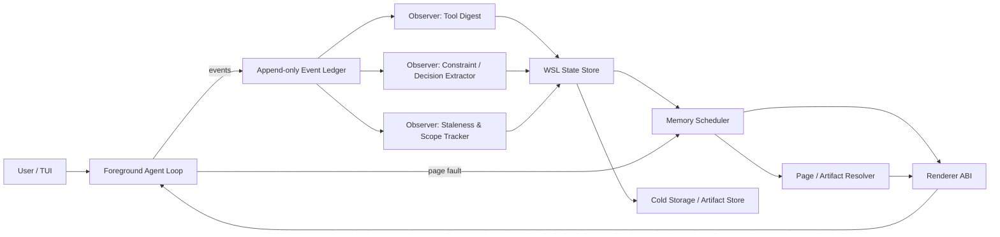
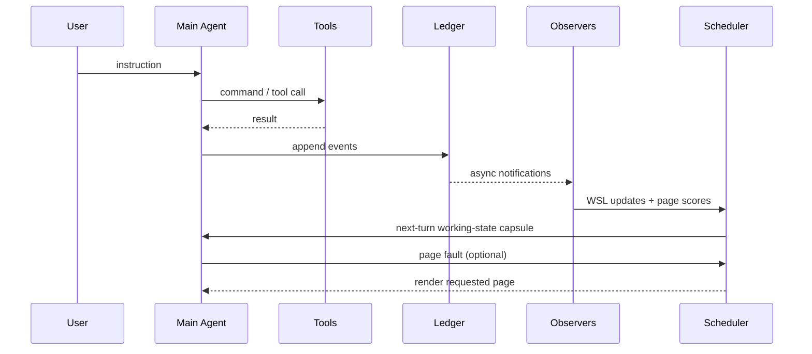
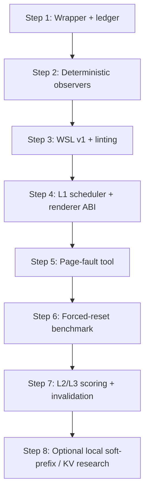

# Working-State Virtual Memory for LLM Agents

**Abstract.** Long-horizon LLM agents fail less like perfect log processors and more like overloaded processes with no real memory manager. Public provider documentation now explicitly treats the context window as a bounded working memory, warns that larger windows do not guarantee reliable recall, and recommends compaction, memory, and tool-result management as separate context-engineering strategies rather than one universal fix. At the same time, adjacent research has converged on the same diagnosis from different directions: long contexts degrade retrieval quality; summary-only compaction is lossy; indexed external memory can preserve evidence better than truncation; and context management is increasingly being reframed in operating-system terms such as working sets, demand paging, caching, and pinning. This report refines that framing into a concrete research proposal: a Unix-inspired **Working-State Virtual Memory** runtime built around a typed internal protocol (**WSL**), an append-only event ledger, a hierarchical memory system (**L0–L4**), and an **asynchronous memory scheduler** that preserves operational state for hosted or local LLM agents without requiring provider retraining. The full 21-page LaTeX paper and compiled PDF are attached here: [LaTeX source](sandbox:/mnt/data/wsvm_paper.tex) and [PDF](sandbox:/mnt/data/wsvm_paper.pdf). citeturn1search0turn1search3turn14search8turn12search0turn8search0turn2search1turn2search2

## Executive summary

The core research claim is narrow and falsifiable: **for long-running coding or tool-using agents, a local runtime that manages a compact operational working state should outperform transcript-centric continuation and summary-only compaction under the same or smaller active-token budgets**. This proposal does **not** ask OpenAI, Anthropic, or open-model vendors to train on a new private language. Instead, it separates the system into two layers: an internal, typed, validated working-state notation called **WSL**, and an external renderer that emits ordinary structured text capsules for any hosted or local model. That design choice is motivated directly by public API reality: OpenAI’s compaction is useful but opaque, Anthropic explicitly recommends broader context engineering beyond transcript growth, and contemporary research on indexed memory, context dashboards, and demand paging suggests that the winning abstraction is not “keep the whole conversation,” but “keep the right working set resident.” citeturn1search0turn1search8turn1search19turn14search8turn12search0turn8search0turn2search1turn2search2

The design has five pillars. First, an **append-only event ledger** stores exact truth: user instructions, tool results, commands, edits, tests, diffs, and artifacts. Second, **observer workers** watch that ledger and extract structured operational state such as failures, constraints, decisions, invalidations, and next steps. Third, **WSL** records that state in a compact, typed, pointer-rich representation that is readable enough to be learned in-context by ordinary models yet formal enough to lint, diff, scope, invalidate, and rank. Fourth, a **memory hierarchy** manages this state across levels analogous to L1/L2/L3 cache and persistent storage: L0 scratch, L1 active capsule, L2 hot pages, L3 warm project memory, and L4 cold ledger/artifacts. Fifth, an **asynchronous memory scheduler** decides what becomes resident, what gets demoted, what is pinned, and what is fetched on a page fault. This research direction is consistent with MemGPT’s virtual-memory framing, AIOS’s kernel-style services, Pichay’s demand-paging argument, Zep’s temporal graph memory, and newer training-free or RL-based proposals such as VISTA, Focus, and CompactionRL. citeturn0search0turn0search1turn8search0turn7search2turn7search6turn2search2turn2search3turn2search0

The strongest near-term contribution is not a new model. It is a **runtime architecture** that works with today’s models. The evaluation target is also narrow: can the runtime reduce repeated failed attempts, preserve hard constraints, retain exact error signatures, and reduce human re-explanation after forced resets or compaction boundaries in long coding sessions? That can be tested against strong baselines such as raw transcripts, provider compaction, natural-language summaries, YAML checkpoints, retrieval-only memory, and plain Markdown task files. SWE-bench Verified and Terminal-Bench 2.0 are relevant ingredients, but the decisive benchmark should be a custom **forced-reset long-session continuation** protocol that deliberately injects tool noise, failed attempts, user corrections, and context resets. citeturn16search3turn16search8turn16search2turn16search4turn12search4turn14search3

A concise architecture sketch appears below.



## Background and related work

Three research and engineering streams matter most here. The first is **long-context degradation and prompt compression**. “Lost in the Middle” showed that long-context support is not equivalent to robust use of all positions in context, with accuracy dropping when key information is placed in the middle of long sequences. Anthropic’s official docs now operationalize the same concern as **context rot**, warning that more context is not automatically better. LLMLingua and related compression work show that prompt text can often be compressed substantially, but that mainly addresses prompt length and cost rather than exact operational-state preservation. citeturn0search14turn8search14turn1search3turn14search0

The second stream is **memory and context management for agents**. MemGPT is the clearest early articulation of the virtual-memory analogy for LLMs, proposing hierarchical memory movement and interrupt-like control flow. AIOS expands this into a kernel-like layer for agents with scheduling, memory management, storage, and access control. Pichay extends the analogy most directly to the context-window problem, arguing that the context window should be treated as L1 cache and reporting demand-paging style management of evictions, faults, and pinning. More recent systems split between training-based and interface-based approaches: CompactionRL trains open models to operate under context compaction; Memex(RL) stores indexed experience rather than summary-only compressed history; Focus lets agents decide when to compress and prune their own histories; and VISTA exposes typed context blocks and per-block usage/recency/access telemetry so the agent can manage context with a visible dashboard rather than only through external compaction. citeturn0search0turn0search1turn8search0turn2search0turn2search1turn2search3turn2search2

The third stream is **production context engineering and memory products**. OpenAI’s Responses API exposes server-side and standalone compaction, but the compacted representation is intentionally opaque. Codex memories store preferences, workflows, tech stacks, conventions, and known pitfalls, while cautioning that required rules should live in checked-in docs rather than only in memory. Anthropic’s public docs and engineering posts distinguish among compaction, memory, tool-result clearing, context editing, and dynamic skill loading, and explicitly document that cached prefixes still consume context-window capacity. Claude Code and related tooling also expose hook points and persistent project-memory files, which is especially relevant to a scheduler-sidecar design because it shows that **context injection at lifecycle boundaries** is already an accepted pattern. Cloudflare’s Agent Memory shows another production-grade version of the same trend: memory derived from sessions and retrieved when needed rather than stored as unbounded transcript. Zep makes the graph-memory case most directly, positioning a temporal knowledge graph as the memory layer for changing facts, durable recall, and structured context blocks. citeturn1search0turn1search1turn1search20turn12search0turn12search4turn12search8turn14search8turn15search0turn15search2turn13search0turn7search1turn7search2turn7search6

A final related-work class is **runtime and latent communication infrastructure**. vLLM’s PagedAttention and automatic prefix caching are directly informed by paging and cache-block reuse, but at the serving/KV-cache layer rather than the semantic working-state layer. Hugging Face’s cache documentation similarly clarifies how KV caches and `past_key_values` work within a single model/runtime. Prefix-tuning shows that continuous “virtual tokens” can be learned as reusable prefixes, and activation engineering shows that behavior can be steered via hidden-state modifications at inference time. But latent communication across agents or models remains experimental, especially across architectures; the recent latent-communication framework paper explicitly calls out cross-model alignment, fusion strategy, and security as open problems, and LCGuard shows that KV sharing itself can become a leakage surface. This is one reason the present proposal refuses to depend on hidden-state interchange for the hosted-provider path. citeturn4search5turn4search9turn5search0turn5search7turn17search0turn18search1turn11academia18turn11academia19

The table below synthesizes the most relevant adjacent lines and what remains uncovered.

| Line of work | Best idea to keep | Main limitation for this proposal |
|---|---|---|
| MemGPT / AIOS | Treat context as managed memory, not full memory | Broad systems framing; less focused on operator-led coding continuity |
| Pichay | Demand paging, working-set lens, pinning, thrash vocabulary | Still a proxy-layer framing; needs a typed operational state and explicit WSL-like protocol |
| LLMLingua | Budget-conscious prompt compression | Compresses prompt text, not task-operational state |
| CompactionRL / Focus | Agents can learn or decide to compact | Training dependency or weak evidence base for real coding continuity |
| Memex(RL) / Zep | Indexed evidence plus compact summaries | More complex memory substrate; needs a harness-specific scheduler for resident working state |
| Anthropic / OpenAI docs | Context engineering is a stack, not one trick | Provider internals remain opaque; user cannot rely on latent access |

## Problem statement and hypotheses

The formal target is **working-state degradation**. This is narrower than “memory failure” and more operational than “long-context reasoning.” A session is treated as an append-only event sequence \(L = \langle e_1, e_2, ... , e_t \rangle\), where each event has an ID, timestamp, type, payload, and scope metadata such as repo, branch, task, or path. On top of that ledger, the runtime maintains an internal working state \(S_t\) that includes the active task, constraints, failures, decisions, assumptions, invalidations, next-step plan, and page references. The hypothesis is that the **main model should operate from a compact resident set derived from \(S_t\), not from the ledger directly**. That claim is structurally aligned with Denning’s working-set model in operating systems, where performance depends not on total address space but on whether the actively needed subset is resident. citeturn10search1turn10search3turn10search8turn8search0

In this framing, memory levels are semantic rather than purely physical. L0 is per-turn scratch. L1 is the active rendered capsule. L2 contains hot pages the scheduler can quickly materialize. L3 holds indexed warm project or cross-session memory. L4 is the cold ledger and artifact store. A **page fault** occurs when the main agent requests information that is not currently resident. The runtime then resolves and renders the needed page from L2–L4 instead of bloating L1 preemptively. This matches the indexed-evidence logic in Memex(RL), the block-visibility logic in VISTA, and the page-fault analogy in Pichay, while remaining fully implementable through normal tool calls and structured-text reinjection in a hosted-model environment. citeturn2search1turn2search2turn8search0

The empirical hypotheses are straightforward. **H1:** under equal or lower active-token budgets, WSL plus an asynchronous scheduler will outperform transcript truncation and natural-language compaction on post-reset continuation. **H2:** exact evidence stored outside summaries and retrieved by stable IDs will reduce repeated failed attempts and loss of exact error strings relative to summary-only approaches. **H3:** pinning governance- and user-critical constraints outside lossy compaction will reduce later constraint violations, following the mechanism documented in Governance Decay. **H4:** asynchronous maintenance at lifecycle boundaries will give better latency/quality trade-offs than emergency compaction once the thread is already bloated. The paper should treat all four as testable claims, not articles of faith. citeturn3search1turn3search4turn14search3turn12search4

Human-memory analogies help justify the architecture, but only at the abstraction level. Baddeley’s working-memory framework motivates separating tiny active state from broader memory. Tulving’s episodic/semantic distinction motivates separating session events from more stable project knowledge. Hippocampal indexing theory suggests that compact indices into exact evidence may be more faithful than trying to retain all details in active memory. Complementary learning systems motivate fast-changing episodic state plus slower-changing semantic knowledge. None of these imply that human memory is accurate or should be copied literally; they only justify a **multi-store, index-heavy, reconstructive memory architecture** rather than a giant transcript. citeturn9search8turn9search1turn9search6turn9search3turn9search7

A compact design table is useful here.

| Formal object | Purpose | Practical implementation |
|---|---|---|
| Event ledger \(L\) | Durable source of truth | SQLite + artifact blobs or hashes |
| Working state \(S_t\) | Current operational state | WSL v1 records |
| Pages \(P\) | Reusable memory chunks with refs | Hot/warm summaries plus exact refs |
| Hierarchy \(H_t\) | Residency management | L0 scratch, L1 capsule, L2 hot, L3 warm, L4 cold |
| Renderer \(R\) | Provider-facing ABI | Stable tagged structured text |
| Fault service | Demand retrieval | `read_page(id)`, `read_file_slice(path:range)` |

## System design

The central system choice is to keep the **foreground loop synchronous** and the **memory subsystem asynchronous**. Human-agent interaction in coding remains turn-based: user message, agent action, tool output, next user turn. The memory maintenance tasks—tool digestion, error extraction, salience ranking, page creation, invalidation, deduplication, and cold-storage upkeep—run in the background. That split mirrors both real UX expectations and the structure of systems like AIOS, Claude Agent SDK harnesses, and Cloudflare’s long-running-agent primitives, all of which distinguish between foreground decision loops and background resource or state management. citeturn0search1turn12search4turn13search2

A representative timeline is below.



The **event ledger** should be append-only and auditable. Minimal event types include user messages, assistant messages, tool calls, tool results, command runs, command outputs, file reads, file writes, diffs, tests, branch changes, commit changes, human corrections, decisions, assumptions, invalidations, page creations, and page accesses. Large outputs should be stored externally as artifacts with content hashes, not repeatedly inlined into state. This design directly answers a production reality Anthropic emphasizes: tool definitions and especially tool results can overload context; therefore tool-result digestion must be a first-class mechanism, not just “more chat history.” citeturn12search7turn14search8turn12search2

The **observer layer** should be intentionally conservative. The most useful workers are deterministic or lightly model-assisted: a tool-digest worker that extracts exact exit codes, failing tests, error signatures, and changed paths; a constraint/correction worker that preserves user instructions verbatim and marks hard versus soft scope; a decision/avoidance worker that links rejected approaches to the failures that justified them; a staleness/scope worker that invalidates branch-scoped or file-scoped pages when repo state changes; and a reranker that uses embeddings or a small local model only to score relevance and salience rather than write authoritative memory prose. This is also where an “observer” idea overlaps with AgentWatcher: a secondary process can inspect influential context segments or memory candidates before they reach the main model, reducing long-context scanning cost and clarifying policy violations. citeturn3search0turn3search2

The **memory hierarchy** is the backbone of the design.

| Tier | Name | Typical contents | Residency / coherence policy |
|---|---|---|---|
| L0 | Turn scratch | Current user request, current tool result, micro-plan | Ephemeral, cleared unless promoted |
| L1 | Active capsule | Task, hard constraints, last failure, next step, critical refs | Always resident; strict budget; governance pinned |
| L2 | Hot pages | Recent failures, hot files, current-branch decisions | Ranked by scope, recency, access, fault frequency |
| L3 | Warm memory | Stable repo conventions, known-good commands, older pages | Indexed retrieval only; promote on strong match |
| L4 | Cold truth | Ledger, logs, diffs, transcripts, snapshots | Immutable source; never preloaded wholesale |

The coherence policy should be **write-through for truth, never write-back for evidence**. Exact truth is written immediately to the ledger/artifact store. L1–L3 are derived caches. Invalidations must be explicit: branch changes, file renames, commit transitions, human corrections, and policy updates should mark pages stale or invalid. Governance- and user-critical constraints should be pinned and re-injected from durable stores rather than trusted to survive summarization, exactly because Governance Decay demonstrates that compaction can silently erase such policies. citeturn3search1turn3search12

The **WSL v1** specification should be compact, typed, and validator-friendly. A minimal record family includes `@task`, `@constraint`, `@failure`, `@decision`, `@avoid`, `@assumption`, `@invalidated`, `@next`, `@page`, and `@fault`. This is less about syntax aesthetics than about semantics and linting. A record like `@failure` should preserve exact command text, exit code, error signature, file hint, and raw artifact reference. A record like `@constraint` should store the original phrasing, source, strength, and scope. An `@avoid` record should reference the failure or correction that justifies avoidance. An `@invalidated` record should explicitly mark stale targets rather than silently replacing them. A tiny example:

```text
@task T42 phase=debugging priority=hot
goal: fix(stream_cancel_hang)
branch: solver-stream-cancel
dirty: src/runtime/stream.go, src/solver/cancel.rs

@constraint C7 hard source=user
text: "do not rewrite transport layer"
scope: task

@failure F18
cmd: `go test ./runtime -run TestCancelStream`
exit: 1
err: "stream goroutine still blocked"
file_hint: src/runtime/stream.go:118-176
raw: artifact:sha256:...

@avoid A4 reason=failed_attempt ref=F16
text: "previous goroutine cleanup patch"

@next
action: inspect
target: src/runtime/stream.go:118-176
question: "is cancellation propagated before stream recv blocks?"
```

The simplest but most important linting rules are these: no active decision can contradict a hard constraint unless there is an explicit override; pages scoped to one branch cannot be silently auto-promoted into another; `@avoid` and `@invalidated` must reference valid upstream evidence; exact-evidence fields such as commands and error signatures must remain exact rather than paraphrased; and pages whose references are all stale cannot be auto-promoted without revalidation. These are the mechanisms that distinguish WSL from ordinary YAML or Markdown: not purely denser syntax, but stable record types plus contradiction and scope checking. That is why the research paper should compare WSL not only against natural-language compaction but also against “strong YAML.” citeturn1search1turn15search0turn14search5

The **renderer ABI** is the provider-facing contract. Because hosted providers will not understand custom latent protocols, the external rendering should be boring on purpose: tagged structured text, fixed block ordering, stable field labels, exact IDs, exact commands/errors/paths, and a clear page-fault instruction. A useful capsule might look like this:

```text
<working_state>
TASK T42: Fix stream cancellation hang.
PHASE: Debugging.
BRANCH: solver-stream-cancel.
DIRTY FILES: src/runtime/stream.go, src/solver/cancel.rs.

HARD CONSTRAINT C7:
Do not rewrite the transport layer.

LAST FAILURE F18:
Command: `go test ./runtime -run TestCancelStream`
Exit: 1
Error: "stream goroutine still blocked"
Likely file area: src/runtime/stream.go:118-176

AVOID A4:
Do not retry previous goroutine cleanup patch; it failed earlier.

NEXT:
Inspect cancellation propagation before stream recv blocks.

If details are missing, request a page by ID instead of guessing.
</working_state>
```

That rendering style is consistent with current provider realities. OpenAI compaction exists but is opaque; Anthropic context-engineering guidance emphasizes token-efficient tool results, memory, and compaction; Claude Code and Codex both already have file- or hook-based injection surfaces. The scheduler therefore uses WSL internally and speaks structured English externally. citeturn1search0turn1search20turn12search0turn14search8turn15search2

A runtime-comparison table clarifies implementation choices.

| Runtime path | Strengths | Constraints |
|---|---|---|
| Hugging Face Transformers | Maximum control over forward pass, cache objects, adapters, experimental soft prefixes | More engineering complexity; weaker production parity with hosted APIs |
| vLLM | Strong serving substrate, PagedAttention, prefix caching, request-level scale | Primarily about KV efficiency, not semantic memory by itself |
| Ollama | Easiest local OpenAI-like serving and model management | Less direct low-level control over cache surgery or custom latent hooks |
| MLX / MLX-LM | Excellent Apple-silicon local experimentation, unified memory, native local inference | Best on Apple-centric setups; still more experimental for advanced scheduler research |
| Hosted provider + local sidecar | Best base-model quality, easy practical adoption | No hidden-state access; must rely on text/tool ABI |

Official documentation supports each of these roles: vLLM explicitly manages paged KV blocks and prefix caching; Hugging Face exposes KV-cache APIs and explanations; Ollama documents a simple REST API for local model execution; and MLX/MLX-LM are built for efficient Apple-silicon inference and model experimentation. citeturn5search14turn5search0turn4search5turn4search9turn4search14turn19search0turn19search1

The one thing this design explicitly does **not** require is latent or KV-cache interchange across providers. Prefix-tuning and activation engineering are relevant for local research, and latent-communication work is important for future directions, but they remain too architecture-specific and too security-sensitive to anchor a provider-compatible runtime today. The paper should present them as optional extensions, not prerequisites. citeturn17search0turn18search1turn11academia18turn11academia19

## Evaluation and implementation

The evaluation plan should privilege **continuation quality under pressure**, not just ordinary benchmark pass rates. SWE-bench and especially SWE-bench Verified are useful because they ground evaluation in real repositories, issues, and tests. Terminal-Bench 2.0 is useful because it stresses multi-step command-line work in realistic environments. But neither fully captures the exact failure mode this design targets: long sessions containing noise, retries, human corrections, and compaction boundaries. So the core experimental contribution should be a **forced-reset long-session benchmark protocol** layered on top of coding tasks. citeturn16search1turn16search3turn16search8turn16search2turn16search4

That protocol should work like this. For each task, run an agent normally for a fixed amount of work while inserting realistic tool noise: large file reads, multiple shell outputs, at least one failed command or failed patch, and at least one explicit human correction such as “do not do X.” Then trigger a reset event: either actual context reset or forced substitution of the continuation substrate. Resume using each baseline and compare downstream behavior. The baseline set should be strong and somewhat humiliating: raw transcript continuation, provider compaction, a concise natural-language summary, a carefully engineered YAML checkpoint, a Markdown `NOW.md` or equivalent task scratch file, retrieval-only memory, WSL without scheduler logic, WSL plus scheduler, and WSL plus scheduler plus page faults. Anthropic’s own long-running-agent guidance is a useful reminder here: compaction alone is not sufficient even for frontier coding models, because later agent instances can lose the thread or over-trust half-finished project state. citeturn12search4turn14search3

The primary metrics should match the pathologies. Success after reset matters, but it is not enough. The scheduler-oriented metrics are: repeated failed-attempt rate; hard-constraint loss rate; exact-error recall; stale-assumption recurrence; page-fault precision and recall; invalid WSL update rate; active-token budget; latency overhead; and human reminder count. The statistical analysis should be paired wherever possible: paired bootstrap confidence intervals for success differences, McNemar-style tests for binary continuation failures, and mixed-effects or paired nonparametric tests for counts such as retries or reminders. The point is not simply to prove significance, but to show that a working-state runtime produces a meaningful effect size at practical token budgets. Anthropic’s public writing on agent evals reinforces that these system-level measurements matter; agent behavior is a harness outcome, not just a model outcome. citeturn12search6turn12search4

A minimal reproducible proof-of-concept can stay small. Start with a wrapper around a hosted API or local OpenAI-compatible endpoint, an append-only SQLite ledger, a WSL parser/serializer, deterministic observers for command failures and user corrections, an L1 scheduler that builds a small pre-turn capsule, and a single `read_page(id)` tool. That is enough to test the main thesis. Only after that should the project add richer L2/L3 ranking, staleness models, cold-storage maintenance, or optional local-model experiments with soft prefixes and cache reuse. This ordering mirrors both engineering prudence and the empirical structure of the field: strong structured-text baselines must be beaten **before** more exotic representation tricks are justified. citeturn5search0turn4search5turn4search9turn19search0

A practical PoC roadmap is below.



A short timeline view helps sequence the work.

| Phase | Deliverable | Research question answered |
|---|---|---|
| Early baseline | Ledger + L1 capsules + YAML/summary baselines | Does explicit working-state help at all? |
| Core scheduler | WSL + linting + L1/L2 + page faults | Can we beat summary-only and YAML on continuation? |
| Reliability layer | Invalidations, scope rules, pinning, observer hardening | Can we preserve constraints and reduce stale-state poisoning? |
| Runtime breadth | Hosted + local runtime adapters | Is the architecture portable enough to matter? |
| Advanced experiments | Soft-prefix or KV-prefix local-only extensions | Is there value beyond structured text in controlled settings? |

The expected result is not a “solved memory” claim. The expected result is something more mundane and more important: **fewer repeated mistakes after resets, fewer lost user constraints, lower active-token load, and better exact-evidence recall** than transcript-only or summary-only baselines. If the design cannot achieve that against strong YAML checkpoints, it should be simplified or rejected.

## Risks, limitations, and conclusion

The largest technical risk is that **WSL may be unnecessary ceremony**. If carefully engineered YAML or XML plus a simple scheduler performs equally well, then the protocol should collapse to the simpler format. This is why the experimental design must compare WSL not just to bad baselines but to strong structured-text ones. The paper should be explicit about that possibility so it is not read as “inventing a format” for its own sake. citeturn14search8turn12search0

The largest security and governance risks are also clear. Prompt injection can contaminate memory pages or retrieval results; AgentWatcher is relevant here because it shows that monitoring can focus on influential segments rather than whole transcripts. Governance Decay is even more directly relevant: it demonstrates that compaction itself is a safety-critical surface because policies vanish when treated as low-salience content. Latent sharing, if later explored, introduces an even more opaque channel, which LCGuard shows can leak sensitive content through KV artifacts. For that reason, the provider-compatible path should stay text-based at the boundary, pin hard constraints outside lossy compaction, and make the resident capsule inspectable by humans. citeturn3search0turn3search1turn11academia19

There are also UX and organizational risks. A background scheduler can make the foreground agent feel eerie or nondeterministic if it injects context unpredictably. The fix is architectural: allow injection only at safe lifecycle boundaries such as before a model turn, after a tool result, or on a page fault. Team memory introduces permission and trust issues as well. Here the production memory systems point in the right direction: Cloudflare emphasizes exportability and narrow APIs, while Zep emphasizes temporal validity and structured graphs rather than raw transcript replay. The working-state runtime should adopt the same posture: inspectable pages, explicit deletion, clear scoping, and easy export. citeturn13search0turn7search1turn7search16

The conceptual limitation is that no scheduler or protocol can force a model to reason well. Better memory management can remove preventable degradation, but it cannot cure every planner failure, every hallucination, or every model weakness. Likewise, the Unix-memory analogy is powerful but incomplete: safety policy, repo semantics, and human correction are not literally cache lines. The value of the analogy lies in its operational vocabulary—working set, pinning, invalidation, demand paging, and thrashing—not in pretending that agent context is just hardware memory with different fonts. Denning’s original working-set theory matters here precisely because it separated *total address space* from *currently needed state*; that is the right abstraction to borrow. citeturn10search1turn10search3turn10search8

The conclusion, then, is deliberately modest. A compelling near-term contribution is not a new frontier model and not a demand that providers “learn WSL.” It is a **hosted-model-compatible memory-management runtime** that treats context as a resident working set, preserves operational state in a typed internal representation, uses asynchronous scheduling to maintain that state continuously, and restores exact evidence by page fault rather than by stuffing more transcript into the prompt. That is scientifically legible, practically buildable, benchmarkable against strong baselines, and sufficiently different from current transcript-first harnesses to matter as a field signal.